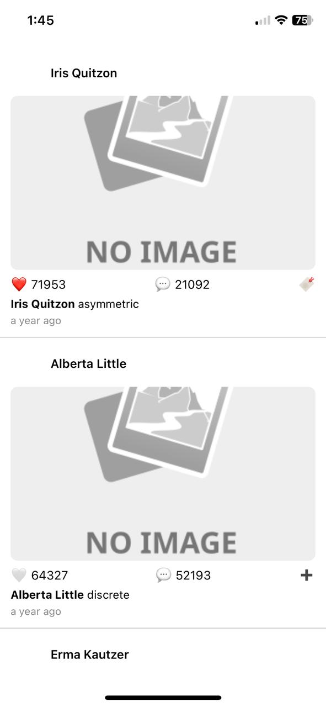

# 📸 Zumbale Feed App – Zumbale Mobile Engineer Challenge

This is a React Native (Expo) implementation of a simplified Instagram-like feed, built as part of the technical assessment for Zumbale's Mobile Engineer position.

---

## 🚀 Features

- ✅ Clean Architecture (Feature-first structure)
- ✅ Fetches posts from public API using Axios
- ✅ Renders feed using `FlatList`
- ✅ Includes:
  - Avatar + Name (header)
  - Post image (content)
  - Like, Save, Comment count (interaction section)
  - Caption + Relative date using `moment.js`
- ✅ Local toggling of **Like** and **Save**
- ✅ Responsive and styled using native components

---

### App Screenshot



#### 🧪 Tech Stack

- [React Native](https://reactnative.dev/)
- [Expo](https://expo.dev/)
- [Axios](https://axios-http.com/)
- [Moment.js](https://momentjs.com/)
- [FlatList](https://reactnative.dev/docs/flatlist)
- Functional Components + Hooks (`useState`, `useEffect`)

##### Installation & Running

```sh
npm install
npx expo start
```


